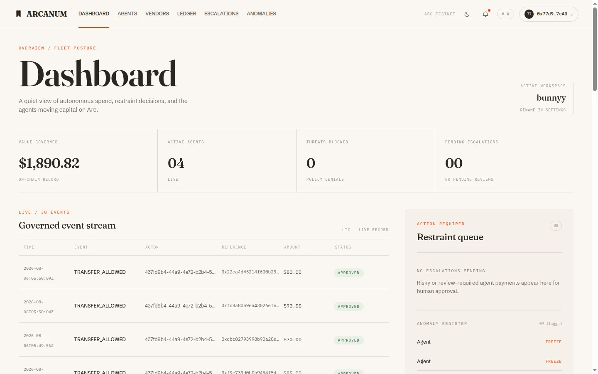
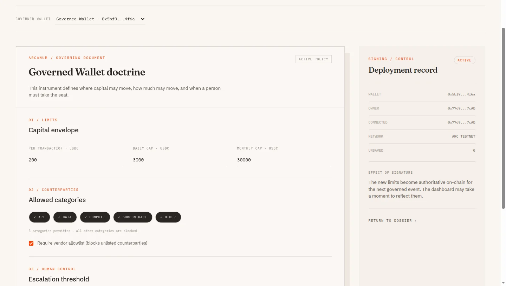
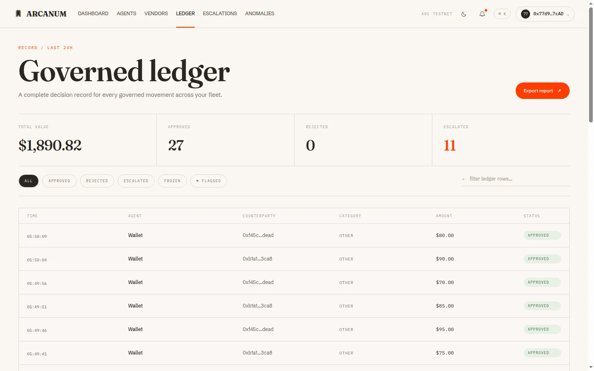
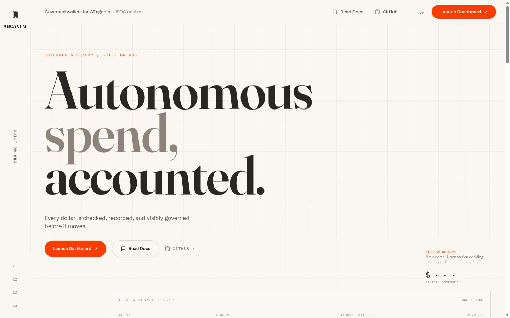
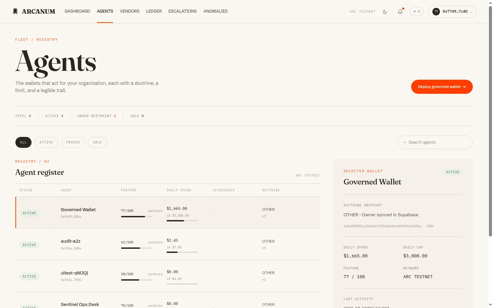

<h1 align="center">ARCANUM</h1>

<p align="center">
  Governed, non-custodial USDC wallets for autonomous AI agents on Arc.
  Every payment is checked against onchain policy before money moves.
</p>

<p align="center">
  <a href="https://thearcanum.in">Live app</a>
  ·
  <a href="#getting-started">Getting started</a>
  ·
  <a href="./docs/CHANGELOG.md">Changelog</a>
  ·
  <a href="./.github/CONTRIBUTING.md">Contributing</a>
</p>

<p align="center">
  <a href="https://github.com/bunnyyxtan/ARCANUM/actions/workflows/ci.yml"></a>
  <a href="./LICENSE"></a>
  <a href="https://github.com/bunnyyxtan/ARCANUM/releases/tag/v2.0.0"></a>
  
</p>

<p align="center">
  
</p>

<p align="center">
  <sub>The operator dashboard: capital under governance, active agents, a live decision stream, and the human restraint queue.</sub>
</p>

## Overview

Arcanum lets you give AI agents real USDC wallets without giving them unrestricted control of funds. It works for anyone who runs agents that spend money: individuals, teams, DAOs, and companies.

AI agents are starting to pay for APIs, compute, data, and tools on their own. A normal wallet gives an agent too much freedom: one bad prompt or one compromised key can drain everything. Arcanum puts the rules inside the wallet itself. A GuardedWallet contract checks every spend against its policy before assets move, and escalates the risky ones to humans.

It combines:

- Smart-contract wallets with owner-defined policy envelopes, called doctrines
- Vendor allowlists, category controls, and per-transaction, daily, and monthly caps
- Human quorum escalation for payments that cross a policy boundary
- Anomaly detection that can flag or freeze unusual agent behaviour
- A public explorer and badge layer so anyone can verify an agent is governed

Unlike an off-chain spend dashboard that an agent can bypass, the enforcement lives where the funds live: in the wallet contract on Arc.

## How it works

1. **Connect a wallet**
   Sign in with any EOA wallet using SIWE. A workspace is provisioned for your organization.

2. **Deploy a GuardedWallet**
   The `WalletFactory` contract deploys a governed wallet for each agent. You keep ownership; the agent gets constrained spending authority.

3. **Attach a doctrine**
   The doctrine defines what the agent may do: spend caps, allowed vendor categories, allowlist requirements, and the threshold where a human must take the seat.

4. **The agent spends, the contract decides**
   Each USDC payment is evaluated by the `PolicyEngine`. Normal payments pass. Boundary-crossing payments are denied, frozen, or escalated to a human quorum.

5. **Everything leaves a record**
   The ledger, event stream, public explorer, and badge pages show the full decision trail for every governed movement.

<p align="center">
  
</p>

<p align="center">
  <sub>The doctrine editor: capital envelope, allowed counterparty categories, and escalation thresholds, signed and deployed on Arc Testnet.</sub>
</p>

## Core capabilities

### Guarded wallets

Each agent receives a non-custodial smart-contract wallet. The operator keeps ownership and governance authority. The agent receives spending ability bounded by the active doctrine.

### Policy doctrines

A doctrine is the wallet's governing document: per-transaction, daily, and monthly USDC caps, allowed vendor categories, allowlist enforcement, and the sensitive threshold that triggers human review.

### Vendor registry

Counterparties are registered with a name, category, and optional per-vendor cap. Agents can pay known infrastructure providers while unknown destinations stay blocked.

### Human escalation quorum

Payments that cross a policy boundary go to a restraint queue where human approvers release or reject them. Autonomy for the routine, review for the sensitive.

### Anomaly defense

An anomaly layer scores agent behaviour and can flag, restrain, or freeze wallets whose activity deviates from the expected pattern.

### Public proof surfaces

Every governed wallet has public explorer and badge pages, so anyone can show that an agent is governed and link to its live decision record.

<p align="center">
  
</p>

<p align="center">
  <sub>The governed ledger: a complete decision record for every movement, with amounts, counterparties, and verdicts.</sub>
</p>

## More screens

| Landing | Agent registry |
| --- | --- |
|  |  |

## Deployed contracts

Network: **Arc Testnet** · Explorer: [testnet.arcscan.app](https://testnet.arcscan.app)

| Module | Address | Responsibility |
| --- | --- | --- |
| WalletFactory | `0x51A560589e23AcD2e57173641267f4583e0e65E7` | Deploys GuardedWallet instances |
| PolicyEngine | `0x67f3731280e1Dfcc38B8a388412FE0c971a4A215` | Evaluates doctrine rules on every spend |
| EscalationManager | `0x9dc6C86469650A3859e7CA9A03adDfE9C964D134` | Quorum approvals for sensitive actions |
| AnomalyOracle | `0x4ee7c78afFd9C5d9e0FD4EFEaEe82BEe32E8C0DC` | Anomaly signals for the policy layer |
| VendorRegistry | `0x0fAe8E2Cd6f22aa9715E256B61f58b42357ABd1b` | Vendor allowlist, categories, and caps |

These are testnet contracts. They are not audited and must not hold production funds.

## Architecture

```text
Agent / Operator wallet
        |
Next.js web app (dashboard, explorer, badges, approver portal)
        |
tRPC API  ·  SIWE sessions
        |
Supabase read models  <──  Ponder indexer  <──  Arc Testnet contracts
                                                 WalletFactory · GuardedWallet
                                                 PolicyEngine · EscalationManager
                                                 AnomalyOracle · VendorRegistry
```

Policy enforcement happens onchain. The indexer turns contract events into read models, and the web app renders the evidence. The server never holds agent private keys.

| Path | Purpose |
| --- | --- |
| `apps/web` | Next.js app: dashboard, landing, public explorer, badges, approver portal |
| `apps/docs` | Documentation site workspace |
| `packages/contracts` | Solidity contracts, Foundry tests, ABIs, deployment scripts |
| `packages/api` | tRPC API layer with session-aware reads |
| `packages/indexer` | Ponder indexer for contract events and read models |
| `packages/db` | Database schema, migrations, seed helpers |
| `packages/auth` | SIWE and session helpers |
| `packages/sdk` · `packages/sdk-py` | TypeScript and Python SDKs |
| `packages/shared` · `packages/ui` · `packages/config` | Shared chain config, UI, and tooling |

## Technology stack

| Layer | Technology | Responsibility |
| --- | --- | --- |
| Contracts | Solidity 0.8.24 · Foundry | Onchain policy enforcement and tests |
| Application | Next.js 15 · React | Operator console and public surfaces |
| Language | TypeScript | Static typing across app, API, and SDK |
| API | tRPC | Typed, session-aware application reads |
| Data | Supabase (PostgreSQL) | Read models, workspaces, audit events |
| Indexing | Ponder | Contract events into queryable rows |
| Auth | SIWE | Wallet-native sign-in and sessions |
| Testing | Vitest · Foundry | API, SDK, and contract test suites |

## Getting started

### Prerequisites

- Node.js 22 or later
- npm 10 or later

### Installation

```bash
git clone https://github.com/bunnyyxtan/ARCANUM.git
cd ARCANUM
npm install
```

### Environment configuration

```bash
cp apps/web/.env.example apps/web/.env.local
```

Fill in the variables before starting. The essentials:

| Variable | Required | Description |
| --- | ---: | --- |
| `ARC_TESTNET_RPC` | Yes | Arc Testnet RPC URL for server-side reads |
| `NEXT_PUBLIC_SUPABASE_URL` | Yes | Supabase project URL |
| `NEXT_PUBLIC_SUPABASE_ANON_KEY` | Yes | Supabase anon key (client-safe) |
| `SUPABASE_SERVICE_ROLE_KEY` | Yes | Server-only Supabase key, never client-side |
| `SIWE_SECRET` | Yes | Server-side session secret |
| `NEXT_PUBLIC_APP_URL` | Yes | Canonical app URL |
| `NEXT_PUBLIC_WALLET_FACTORY` and other contract addresses | Yes | Deployed Arc Testnet addresses, see the table above |

The full annotated list lives in `apps/web/.env.example`. Never commit `.env.local`, private keys, or service-role keys.

### Start development

```bash
npm run dev
```

Open the URL printed by Next.js.

## Commands

| Command | Purpose |
| --- | --- |
| `npm run dev` | Start the development server |
| `npm run build` | Production build of all workspaces |
| `npm run typecheck` | Validate TypeScript types |
| `npm run lint` | Static analysis and formatting checks |
| `forge build` · `forge test` | Compile and test contracts, from `packages/contracts` |

## Testing

- **Contract tests** with Foundry cover policy enforcement, escalation, and wallet behaviour.
- **API and SDK tests** with Vitest cover session-aware reads, governance writes, and client behaviour.
- **CI** runs build, lint, typecheck, contract, and SDK checks on every push.

## Status

Arcanum is a working Arc Testnet build, running publicly at [thearcanum.in](https://thearcanum.in).

- Contracts are deployed on Arc Testnet and listed above. They are not audited.
- The dashboard, public explorer, badge routes, and approver portal are live.
- Advanced write paths and indexer reconciliation are still being hardened.
- A formal audit is required before any mainnet or production-funds use.

Arcanum is non-custodial. It is not an exchange, not a token sale, not a fiat ramp, and not a hosted wallet provider.

## Roadmap

- Testnet hardening: read-model resilience, indexer recovery, richer failure states
- Governance depth: doctrine templates, per-signer controls, stronger anomaly scoring
- Developer experience: deeper SDK examples, integration guides, self-hosting docs
- Audit path: internal reviews and automated coverage ahead of external audit

## Contributing

Contributions are welcome through focused pull requests. Read [CONTRIBUTING.md](./.github/CONTRIBUTING.md) for setup and the review checklist. Releases follow semantic versioning and are tracked in [CHANGELOG.md](./docs/CHANGELOG.md).

## Security

Do not report vulnerabilities through public issues. Follow the private process in [SECURITY.md](./.github/SECURITY.md). Treat all contracts as unaudited testnet code.

## License

Source available. The code is public for reading and review. Using, copying,
modifying, or hosting it requires written permission. See
[LICENSE](./LICENSE) for the full terms.
