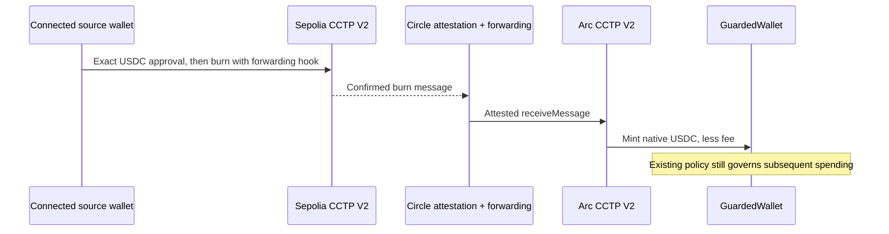

# Fund an Arc wallet from Sepolia with CCTP

Arcanum supports one inbound testnet route: **Ethereum Sepolia USDC →
Arc Testnet USDC**, minted directly to the selected `GuardedWallet`.
Circle CCTP V2 burns native USDC on Sepolia and attests the message; the default
flow requests Circle's Forwarding Service to submit the destination mint.
An explicit operator relay is available when an attestation is ready but
forwarding has not completed. This is not a wrapped-token
bridge and does not move the governed balance into another custody contract.

The payer needs Sepolia USDC and Sepolia ETH for the approval and burn.
The forwarding fee is deducted from the burn amount. The destination does
not need a separate gas top-up for the forwarded mint.

## Boundaries

- Only Sepolia → Arc Testnet is supported. No mainnet or outbound transfers.
- Funding is a deposit, not a governed payment. It does not authorize a new
  agent, change policy, unfreeze a wallet, or create a payment decision receipt.
- Circle Wallets signing and CCTP funding are separate integrations. The
  browser uses the connected wallet; the CLI can use the existing Circle
  signer. The deposited USDC remains subject to Arcanum's policies when spent.
- Standard Transfer finality is requested (`2000`). Attestation and forwarding
  are asynchronous; a confirmed source burn is not a completed deposit.
- CCTP relies on Circle attestations. The application checks the source burn
  and destination mint onchain; it does not claim independence from Circle
  or guarantee forwarding availability.
- V2 source messages contain fields that Circle fills when attesting,
  including the nonce and executed fee. Verification binds the immutable
  transfer fields and source transaction identity; it must not expect the
  original and attested message bytes to be identical.



## Dashboard

Open a governed wallet under **Agents**, then **Inbound funding**.

1. Connect the source wallet and enter the total USDC to debit on Sepolia.
2. Request a live quote. Review the fee cap and minimum USDC received.
3. Confirm the wallet approval and burn prompts on Sepolia.
4. Keep the source burn transaction hash. The page watches the same transfer
   after reload; **Resume** can restore it from the hash in another browser.
5. Completion requires a verified Arc mint, not only an Iris API response
   whose attestation status is `complete`.

The destination is the selected governed wallet, not an editable payment
address. A failed status check is displayed as an error, not as a failed
burn or permission to send again. No background effect submits transactions.

## SDK

The browser-safe subpath is `arcanum-sdk/cctp`. It has no Circle API-key
requirement and does not import the Node-only Circle signing adapter.

```ts
import {
  buildCctpTransactions,
  getCctpQuote,
  getCctpStatus,
} from "arcanum-sdk/cctp";

const quote = await getCctpQuote("5"); // total USDC burned, including fees
const transactions = buildCctpTransactions({ recipient: guardedWallet, quote });
// The caller submits transactions.approval, waits for success, and validates
// the still-current quote/account/chain before submitting transactions.burn.
// Building these requests does not sign or broadcast anything.

const transfer = await getCctpStatus({ burnTxHash, recipient: guardedWallet });

// An operator-supplied destination hash is only a candidate. It still has to
// pass the same source, attestation, destination call, receipt and mint checks.
const recovered = await getCctpStatus({
  burnTxHash,
  recipient: guardedWallet,
  mintTxHash: manuallyRelayedMintHash,
});
```

Quotes expire. The payer must request and review a new quote if approval takes
too long; Arcanum never silently substitutes a higher fee. Amounts are decimal
strings in six-decimal ERC20 USDC units, including on Arc. Arc's native gas
denomination uses 18 decimals; it must not be used to calculate CCTP amounts.

## CLI

From the repository root, with dependencies installed:

```sh
export GUARDED_WALLET=0xYourArcGuardedWallet
npx tsx scripts/cctp-fund.ts quote 5
```

For signing, either configure all four existing Circle signer variables
(`CIRCLE_API_KEY`, `CIRCLE_ENTITY_SECRET`, `CIRCLE_WALLET_ID`,
`CIRCLE_WALLET_ADDRESS`) or provide `CCTP_PRIVATE_KEY` securely. Never paste
keys into commands saved in shell history or commit them. The CLI does not
silently use the deployer key.

```sh
# Testnet only. This explicitly authorizes an approval and source burn.
npx tsx scripts/cctp-fund.ts start 5 --confirm

# Read-only recovery: neither command submits another burn.
npx tsx scripts/cctp-fund.ts status 0xSourceBurnTransactionHash
npx tsx scripts/cctp-fund.ts watch 0xSourceBurnTransactionHash
```

## Recovery and verification

The source transaction hash is the portable recovery identifier. Browser
storage and CLI files are conveniences, not the source of settlement truth.
The status check binds that hash to the selected destination and validates
the route, token, amount and onchain outcome. It does not accept a different
recipient's transfer as funding this wallet.

A broadcast can succeed even if a wallet/RPC response is lost. An unresolved
submission marker intentionally blocks starting over: inspect the source
wallet's transaction history and resume the existing hash first. Do not
delete a pending record just to retry. A source burn is not reversible by
closing the page, resetting a form or reverting application code.

Recovery must identify the original request, not merely a previous transfer
from the same account. Pending submissions retain their source nonce, block
anchor and reviewed transfer terms. A recovered transaction must match them
before it can clear that guard. Older incomplete records without those
identifiers remain blocked rather than being assigned an unrelated hash.

The CLI is additionally conservative when a broadcast returned no hash:
it will not adopt a supplied hash into that unresolved local record. Inspect
the source account and transaction evidence manually before changing that
record. Never erase the guard simply because the RPC request reported an error.

If Circle forwarding is delayed, keep the same burn hash and retry the
read-only status check. Do not burn more USDC to retry the original transfer.
Provider outages, insufficient fee budget or attestation problems may require
Circle's recovery process; this interface does not promise automatic recovery
from every provider-side failure.

### Explicit operator relay

When an attestation is available but forwarding has not completed, an operator
can explicitly submit that same attestation on Arc. This is a separate manual
recovery step, not automatic forwarding and not another source burn.
The current demo runner is deliberately pinned to the approved transfer,
recipient and Circle signer; it is not a generic relay command for other burns.

```sh
npx tsx scripts/cctp-relay.ts 0xe53412c49a9e3524105e893b48812fa1e7859fb68c27d8160c3b70b82a28bbd9 --confirm
```

The operator must retain the matching source state and pending guard, and use
the configured funder. The relay only calls Arc's pinned `receiveMessage` with
zero transaction value. It simulates first and caps the entire destination gas
budget at **0.01 native USDC** (18-decimal gas units). That gas is paid from
the relay signer's Arc balance, separately from any attested CCTP fee.

An exclusive relay journal prevents automatic resubmission. The signed
transaction hash is saved before broadcast, so a lost RPC response is followed
by status recovery, not a new transaction. A journal without a hash requires
operator inspection; it is not silently discarded. Completion still requires
verified source and destination evidence before clearing the source guard.

The regular CLI status command reuses the saved mint hash. The read-only
status API also accepts an explicit `mintTxHash` for verification. Browser
funding remains the automatic-forwarding flow; no browser effect performs a
manual relay. Record a manually relayed deposit as such in demo evidence.

The API exposes only read-only quote/status operations. It does not accept
arbitrary upstream URLs, sign transactions, persist keys or modify the
receipt database. Responses are uncached and request-limited per process.

## Official references

- [Sepolia → Arc quickstart](https://developers.circle.com/cctp/quickstarts/transfer-usdc-ethereum-to-arc)
- [CCTP contract addresses](https://developers.circle.com/cctp/references/contract-addresses)
- [Forwarding Service](https://developers.circle.com/cctp/concepts/forwarding-service)
- [Forwarding walkthrough](https://developers.circle.com/cctp/howtos/transfer-usdc-with-forwarding-service)
- [Fee estimates](https://developers.circle.com/api-reference/cctp/all/get-burn-usdc-fees)
- [Messages and attestations](https://developers.circle.com/api-reference/cctp/all/get-messages-v2)
- [V2 message format](https://developers.circle.com/cctp/references/technical-guide)