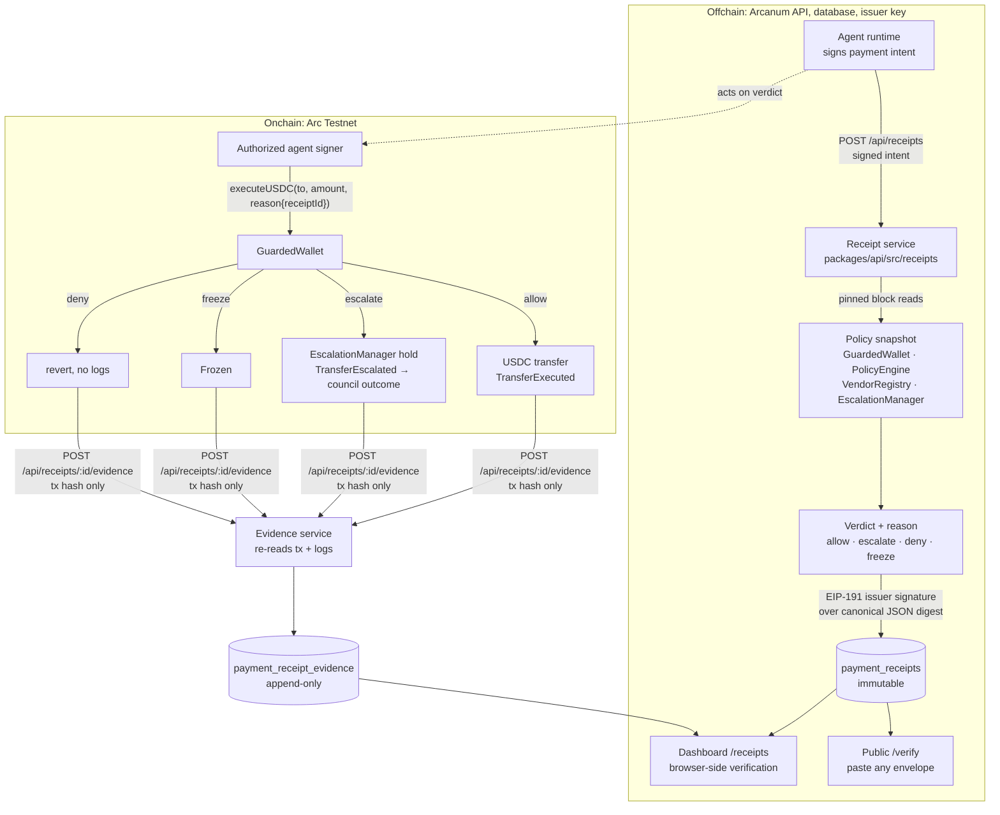

# Payment decision receipts

A payment decision receipt is a signed, offline-verifiable statement of what a
governed wallet's policy decided about one agent payment intent, at one pinned
Arc Testnet block, before anything was sent onchain. Agents attach the receipt
id to the transaction that acts on it, and the API later links the two, so an
auditor can put the decision and its consequence side by side.

Receipts were built for ETHOnline 2026 on top of the existing Arcanum stack.
[`PRE-EXISTING.md`](../PRE-EXISTING.md) separates what existed from what is new.

## What a receipt is, and is not

| A receipt is | A receipt is not |
| --- | --- |
| Arcanum's issuer signature over a policy snapshot and a verdict | an authorization to move funds |
| bound to the agent's own signed request (its signature is inside the body) | a signature by the agent over Arcanum's verdict |
| an evaluation at one pinned block, with the block hash in the body | settlement, or a promise the chain will decide the same later |
| verifiable by anyone against a published issuer registry | dependent on Arcanum being online to check |

Four distinctions the design refuses to blur:

1. **The agent signature covers the request, the issuer signature covers the
   receipt.** The agent signs the payment intent (the existing
   `ARCANUM_PAYMENT_INTENT_V1` message). That signature is copied into the
   receipt body as `request.signature`. The issuer then signs the digest of
   the whole body. Neither party ever signs on the other's behalf.
2. **Preflight is not settlement.** `GuardedWallet.executeUSDC` re-evaluates
   policy in the block that includes the transaction. The receipt records the
   verdict at `evaluation.blockNumber`; state can move between that block and
   inclusion. This is why evidence exists, and why evidence records whether
   the chain agreed (`details.verdictMatches`).
3. **A revert leaves no logs.** A denied `executeUSDC` reverts, so there is no
   onchain `Denied` event to point at. A reverted transaction is recorded as
   `execution/reverted` evidence from the transaction receipt status alone.
4. **A receipt never authorizes a transfer.** The contract does not know
   receipts exist. An `allow` receipt for a wallet whose signer was rotated
   away a block later produces a revert, not a payment.

## Architecture



The API, the database and the issuer key are offchain. Policy enforcement,
transfers, holds and council decisions are onchain and unchanged by this
feature. The chain reads used to build a receipt are ordinary `eth_call`s at a
pinned block; nothing is written onchain to issue a receipt.

## The receipt format

An envelope has three members:

```json
{
  "receipt": { "schema": "arcanum.payment-receipt.v1", "...": "body" },
  "receiptDigest": "0x…32 bytes…",
  "signature": "0x…65 bytes…"
}
```

- `receipt` is the body. Its schema is strict: unknown members are rejected,
  every address is lowercase, and every value that can exceed 2^53 (amounts,
  caps, block numbers, policy versions) is a decimal string. Small integers
  (`chainId`, `blockTimestamp`, the vendor `category` index) are JSON numbers.
  The body therefore has exactly one canonical serialization.
- `receiptDigest` is SHA-256 of the body serialized with the RFC 8785
  (JSON Canonicalization Scheme) subset in `packages/shared/src/receipts/canonical-json.ts`.
- `signature` is an EIP-191 personal signature by the issuer key over
  `ARCANUM_PAYMENT_RECEIPT_V1\n<receiptDigest>`.

The body carries:

| Member | Content |
| --- | --- |
| `receiptId`, `issuedAt`, `issuer { keyId, address }` | identity; verifiers resolve the key by `keyId` in the registry, never by the address written in the body |
| `request` | the agent's normalized intent including its `signature`; `requestDigest` is the EIP-191 hash of the intent message the agent signed |
| `amountBaseUnits` | the exact 6-decimal USDC amount the policy engine was asked about |
| `decision { verdict, reasonCode, explanation }` | `allow`, `escalate`, `deny` or `freeze`, with the policy engine's reason |
| `evaluation` | `blockNumber`, `blockHash`, `blockTimestamp`, module addresses, the policy at that block, signer authorization, frozen flag, vendor registry entry, spend counters and USDC balance |

`evaluation.spend` records the counters as stored and as `executeUSDC` would
see them after rolling the daily and monthly windows at the block timestamp,
so the receipt evaluates the same numbers the contract would.

### Issuer registry

`packages/shared/src/receipts/issuers.ts` publishes the issuer keys, each
bound to one chain id with a validity window. The API refuses to issue when its
configured key is not an active registry entry for the running chain, so a
receipt can never be signed by a key verifiers cannot resolve. Retired keys
stay listed so old receipts keep verifying and a receipt dated after retirement
is reported as such.

The current key is `arc-testnet-2026-09`
(`0x768020000608ab6afc28a15b2b03a00273ef3288`, Arc Testnet, chain 5042002).

### Verification

`verifyPaymentReceipt(envelope)` from `@arcanum/shared` (re-exported by the
SDK) runs four independent checks and reports each one: `format`,
`receiptDigest`, `issuer` (registry lookup, chain match, validity window,
signature recovery) and `request` (the agent's signature recovers to
`request.agentSignerAddress`, the request digest matches, `amountBaseUnits`
matches the amount). `ok` is true only when all four pass. The dashboard and
the public `/verify` page run exactly this function in the browser; no API
call is involved.

## Issuance

`POST /api/receipts` (REST) or `receipts.create` (tRPC) takes the signed
payment intent the SDK already produces (`signPaymentIntent`). The route is
public in the same sense the preflight is: the agent's signature is the
credential, and only an authorized signer of a wallet the read model knows
gets a receipt back.

Evaluation order, all at one block:

1. Intent is validated. A zero vendor address or an unsupported token is an
   input error (`INVALID_RECIPIENT`, `UNSUPPORTED_TOKEN`), not a verdict.
2. The wallet must exist in the read model (`WALLET_NOT_REGISTERED`) and the
   signer must be authorized on the wallet at the block (`AGENT_NOT_AUTHORIZED`).
   Neither case produces a receipt: an unauthorized caller must not be able
   to mint signed statements about someone else's wallet.
3. A frozen wallet yields `freeze` without consulting the policy engine, as
   the contract would.
4. Otherwise the policy engine is called with the rolled-over spend counters
   and its verdict and reason become the decision.

Reads are pinned to one block by number, which is all `eth_call` offers, so
after the last pinned read (the policy call) the block is fetched again and
its hash compared with the one about to be signed. A block replaced in
between fails the request with `CHAIN_READ_FAILED` instead of producing a
receipt for a chain state that no longer exists.

Receipts attest decisions only. Infrastructure failures (`CHAIN_READ_FAILED`,
`RECEIPT_STORE_UNAVAILABLE`, `RECEIPT_ISSUER_NOT_CONFIGURED`) are errors and
never become signed receipts.

### Idempotency

The signed `reference` is the idempotency key, namespaced by chain, wallet and
signer. Re-posting the same signed intent returns the stored receipt
(`replayed: true`, HTTP 200). Posting a different intent under an already
used reference is `REQUEST_KEY_CONFLICT` (409). Two concurrent first requests
race on the database unique key and both receive the winning row. A replay
is answered before the issuer key is looked up, so a receipt already issued
stays retrievable while the key is being rotated.

### Errors

REST errors are `{ "error": { "code", "message", "issues"? } }` with the
status from the table below. Over tRPC, errors raised by the receipt service
carry the same code in `data.domainCode`; schema validation and rate limiting
surface as tRPC's own `BAD_REQUEST` and `TOO_MANY_REQUESTS`.

| Code | Status | Meaning |
| --- | ---: | --- |
| `INVALID_REQUEST` | 400 | REST only: malformed JSON, a non-UUID id, or a body that failed schema validation (`issues` lists why) |
| `SIGNATURE_INVALID` | 400 | agent signature does not recover to `agentSignerAddress` |
| `UNSUPPORTED_CHAIN`, `UNSUPPORTED_TOKEN`, `UNSUPPORTED_WALLET_TOKEN`, `INVALID_AMOUNT`, `INVALID_RECIPIENT` | 400 | the intent cannot be evaluated as stated |
| `INVALID_TRANSACTION_HASH` | 400 | evidence: `txHash` is not a 32-byte hex string |
| `AGENT_NOT_AUTHORIZED` | 403 | signer is not authorized on the wallet; no receipt is issued |
| `WALLET_NOT_REGISTERED` | 404 | the read model has no such wallet, or it has no workspace |
| `RECEIPT_NOT_FOUND` | 404 | unknown id, or not visible to the caller (indistinguishable on purpose) |
| `TRANSACTION_NOT_FOUND` | 404 | evidence: transaction not found or not yet mined |
| `REQUEST_KEY_CONFLICT` | 409 | reference reused for a different intent |
| `EVIDENCE_CONFLICT` | 409 | evidence: the transaction is already linked to another receipt |
| `EVIDENCE_MISMATCH` | 412 | evidence: the transaction is not this receipt's `executeUSDC` call |
| `RATE_LIMITED` | 429 | shared rate limit |
| `INTERNAL_ERROR` | 500 | REST only: an unexpected failure; the details stay in the server log |
| `CHAIN_READ_FAILED` | 502 | RPC failure during evaluation; nothing was stored |
| `RECEIPT_ISSUER_NOT_CONFIGURED`, `RECEIPT_ISSUER_NOT_REGISTERED`, `RECEIPT_STORE_UNAVAILABLE` | 503 | the deployment cannot issue right now |

## Reading receipts

`receipts.list` and `receipts.get` (tRPC, SIWE session required) return
receipts for the wallets visible in the caller's workspace, plus receipts the
caller requested as an agent signer. `get` also admits the wallet's current
onchain council members, because approvers need the receipt to judge an
escalation they did not request. Council membership is read from the wallet's
own `escalationManager()` at the current block, not from the deployment
manifest, because `GuardedWallet.rotateModule` can point a wallet at a
different manager.

Anyone else receives `RECEIPT_NOT_FOUND`; receipt ids must not leak which
wallets exist.

The dashboard pages are `/receipts` (history) and `/receipts/<id>` (detail,
evidence timeline, browser-side verification, raw JSON). The public `/verify`
page verifies any pasted envelope offline.

## Evidence

`POST /api/receipts/:id/evidence` with `{ "txHash": "0x…" }` (or tRPC
`receipts.attachEvidence`) links a receipt to what happened onchain. The
caller proves nothing but a hash; the service reads the transaction and its
receipt and requires that:

- the transaction is an `executeUSDC` call **to the receipt's wallet**, **from
  the receipt's agent signer**, for the receipt's vendor and amount; otherwise
  `EVIDENCE_MISMATCH`;
- a successful call emitted **exactly one** wallet event, and that event names
  the receipt's wallet, signer, vendor and amount (as far as each event
  carries them); otherwise `EVIDENCE_MISMATCH`;
- if the reason bytes carry SDK metadata naming a receipt, it is this one;
  otherwise `EVIDENCE_MISMATCH`;
- no other receipt already holds an execution row for the hash; otherwise
  `EVIDENCE_CONFLICT`. One call acted on one decision. The check is a lookup
  before the insert, not a database constraint, so two receipts linking the
  same hash in the same instant can both succeed; the rows are append-only
  and carry the hash, so the duplication is visible rather than hidden.

It then records, append-only:

| Kind / outcome | Source |
| --- | --- |
| `execution/reverted` | transaction receipt status `reverted` (no logs survive) |
| `execution/executed` | `TransferExecuted` emitted by the wallet |
| `execution/escalated` | `TransferEscalated` emitted by the wallet |
| `execution/frozen` | `Frozen` emitted by the wallet |
| `escalation/<status>` | for escalated payments, the escalation's current status read from the manager the wallet pointed at in that block: `pending`, `released`, `rejected`, `expired`, `denied`, `cancelled`, `invalidated` |

Posting the same hash again later is how an escalation's resolution gets
recorded: the execution rows are already there and are ignored, and a new
`escalation/<status>` row is appended when the status changed. Every row
carries `calldataNamesReceipt` (whether the `executeUSDC` reason bytes mention
the receipt id or digest). Execution rows also carry `details.verdictMatches`,
whether the chain did what the receipt said it would; escalation status rows
describe a later resolution, so theirs is `null`.

A reverted call keeps no reason onchain, so for a `deny` receipt it is
consistent but unproven and `verdictMatches` stays `null`; for any other
verdict a revert is a plain disagreement (`false`).

Denied receipts are linkable too. An agent that ignores a `deny` and sends
anyway leaves a reverted call (`verdictMatches: null`); a policy loosened after
issuance leaves an executed one (`verdictMatches: false`). Both are worth
recording.

## SDK

```ts
import { ArcanumClient, arcTestnet, ARC_TESTNET_RPC_URL } from "arcanum-sdk";

const arcanum = new ArcanumClient({
  walletAddress: process.env.GUARDED_WALLET as `0x${string}`,
  agentSigner,
  chain: arcTestnet,
  rpcUrl: ARC_TESTNET_RPC_URL,
  apiUrl: "https://thearcanum.in",
});

// Receipt only: nothing moves onchain.
const { receipt, replayed } = await arcanum.requestPaymentReceipt(intent);

// Receipt first, then execution only for allow/escalate, then evidence.
const outcome = await arcanum.executePaymentIntentWithReceipt(intent);
outcome.receipt;        // the signed envelope
outcome.result;         // the existing PaymentIntentResult, txHash included
outcome.evidence;       // rows the API linked, or null when nothing was sent
outcome.evidenceError;  // set when the payment happened but linking failed
```

Both methods verify the receipt before returning it: issuer signature against
the registry (`receiptIssuers` in the client config overrides it for a
self-hosted issuer), receipt digest, the agent's own request signature, and
that the receipt's `requestDigest` is the digest of the intent just signed.
A receipt that fails is an `ArcanumError` with code `RECEIPT_UNVERIFIED`, and
a valid receipt for some other intent is `RECEIPT_MISMATCH`; neither is acted
on. A body that is not a receipt envelope at all, or that lacks a boolean
`replayed` flag, is a `ReceiptRequestError` with code `MALFORMED_RESPONSE`.
The API transports receipts; it is not trusted to say what they contain.

`executePaymentIntentWithReceipt` puts the receipt id into the `executeUSDC`
reason metadata, so the chain itself names the decision it acted on. `deny`
and `freeze` verdicts never reach the chain. A receipt that comes back
`replayed: true` is not acted on either: the earlier attempt may already have
paid, and the contract does not deduplicate references, so the result is a
`validation_error` with `errorCode: "RECEIPT_REPLAYED"` until the caller passes
`{ executeReplayedReceipt: true }` (after checking the receipt's evidence) or
uses a new reference. A transaction that reverts is
still linked as evidence, and when execution returns a hash but linking fails,
the hash is reported next to the linkage error rather than dropped. One gap
remains: if the RPC fails while the SDK waits for inclusion, the execution
error carries no hash, and the transaction has to be linked afterwards with
`attachPaymentReceiptEvidence`. Receipts can be verified with the SDK's
re-exported `verifyPaymentReceipt` without contacting the API.

## Testnet walkthrough

Prerequisites: a governed wallet deployed from the dashboard with an authorized
agent signer, some Arc Testnet USDC in it, and Node 24.

1. Configure the API. Put the issuer key in `apps/web/.env.local` as
   `ARCANUM_RECEIPT_ISSUER_PRIVATE_KEY` (locally, any key whose address you add
   to the issuer registry works; production uses the published key). Apply
   `supabase/migrations/20260910120000_payment_receipts.sql`.
2. Start the app (`npm run dev`) and sign in.
3. From an agent runtime, request a receipt for a small payment inside the
   per-transaction cap, then one above the escalation threshold, then one to a
   vendor outside the allowed categories. Expect `allow`, `escalate`, `deny`.
   `scripts/receipts-demo.ts` does this with the SDK
   (`npx tsx scripts/receipts-demo.ts allow|deny|escalate`; the environment
   it reads is listed at the top of the file) and writes each envelope to
   `demo-output/`.
4. Run `executePaymentIntentWithReceipt` for the allowed and the escalated
   intents (`receipts-demo.ts allow --execute`, `escalate --execute`). The
   allowed one transfers USDC and is linked as `execution/executed`; the
   escalated one creates an onchain hold and is linked as
   `execution/escalated` plus `escalation/pending`.
5. Approve or reject the hold from the approver portal, then post the same
   transaction hash again to `/api/receipts/<id>/evidence`
   (`receipts-demo.ts link <receiptId> <txHash>`). The new
   `escalation/<status>` row appears on the receipt.
6. Open `/receipts` and each receipt's detail page; every check in the
   verification panel is computed in the browser. Download the JSON, then
   paste it into `/verify` in a private window to confirm it verifies without
   a session. Change one character and watch the digest check fail.

## Limitations

- **Snapshot, not settlement.** The chain decides at inclusion. Evidence
  records disagreement; it cannot prevent it.
- **One issuer key.** The registry supports rotation and retirement, but the
  deployment signs with a single hot key held by the API. Verification checks
  the receipt's own `issuedAt` against the key's validity window, and a
  receipt does not prove when it was really signed, so a compromised key can
  forge backdated receipts even after it is retired; retirement only stops
  forgeries dated after `retiredAt`. Anyone who needs to trust an old receipt
  should also find it in the API, which stores every issued one. The key
  cannot move funds.
- **Offchain storage.** Receipts and evidence live in the same Supabase
  database as the rest of the read model, immutable by trigger and served
  through the service role only. Nothing about a receipt is anchored onchain
  unless the agent puts the receipt id into the transaction calldata, which
  the SDK does by default.
- **Evidence trusts the RPC.** Linking re-reads the transaction from the
  configured Arc Testnet RPC; a lying RPC could misclassify evidence. The
  transaction hash is stored so anyone can re-check it independently.
- **Replay protection is client-side.** The contract does not know about
  receipts or references, so a second `executeUSDC` for the same reference
  is a second payment onchain. The SDK refuses to act on a replayed receipt
  by default; a caller using the REST API directly has to keep that rule.
  The `replayed` flag itself is the API's statement about its own store and
  is not covered by the signature: the SDK requires it to be present, but an
  API you do not operate could omit the truth. Against such an API, keep your
  own record of references you have already paid.
- **Council membership is a point-in-time read.** Access for approvers is
  evaluated against the wallet's manager at request time. Evidence status for
  a hold is read from the manager the wallet used in the block of the
  transaction, so a later `rotateModule` cannot hide an old escalation, but a
  manager contract that was itself replaced with something malicious could
  report anything.
- **No receipts for input errors or outages.** A request the API cannot
  evaluate produces an error, not a signed statement, so the absence of a
  receipt proves nothing by itself.
- **Testnet only.** The contracts are unaudited and the issuer registry lists
  only an Arc Testnet key.
